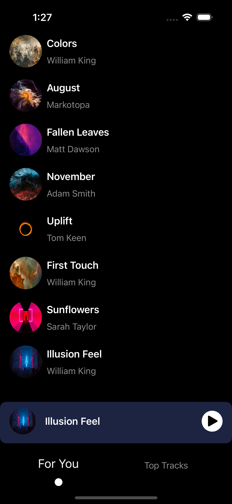
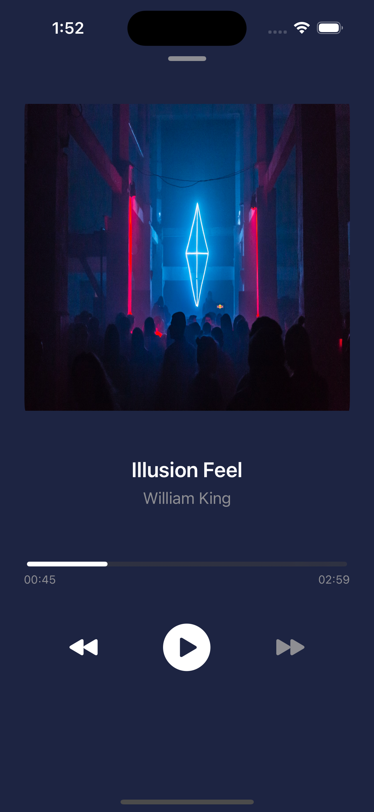

# Samespace Assignment - Music Player
### iOS Assignment 

## Technologies Used
- Language: Swift
- Frameworks: SwiftUI, AVKit, Core Haptics and UIKit Extensions
- Target: iOS 17.0+

## Features
- Checking **Networking Connectivity**
- Fetching Data using REST Apis
- Fetching Images Async and **Caching them along**
- **Shimmer Loading Animations**, **Drag down to reload**
- Swipe to Change Tabs
- **Haptic Feedback** during Interactions
- **Dynamic Background Color** according to Music Cover
- Music Player in Background
- **Drag Desture** to minimize the Player and **Smooth Transition** between Collapsed Music player and Expanded
- **Auto Next Music Playback**
- Auto Loop, playing the first music in the list after the last music ended

## Demo and Screenshots

<video width="320" height="240" controls>
  <source src="Demo01.mp4" type="video/mp4">
  Your browser does not support the video tag.
</video>
